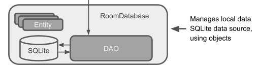

# Tutorial 4

?> Review 1.1 - Add Pokemon List <br>
Review 1.2 - Correct name in menu pokemon_regions, 


> Goals
> Build a full aplication using Clean Architecture with MVVM

# App - Pokedex

## First Challenge - Data Binding

**[Data Binding](https://developer.android.com/topic/libraries/data-binding)** is a feature provided by Android Jetpack that allows you to bind UI components in your layout directly to data sources in your app’s code. This means you can avoid writing a lot of boilerplate code to update your UI components with data from your app.

To enable the usage of view models in your Android application, add the following
snippet to the app/build.gradle file.

```kt

plugins {
    id("org.jetbrains.kotlin.kapt")
    id ("kotlin-parcelize")
}

android {
....
    buildFeatures {
        dataBinding = true
        viewBinding = true
    }
}

```


Once you’ve enabled **Data Binding**, you can start using it in your layout files by
enclosing your layout in a "**layout**" tag. Within the "**layout**" tag, you can use the @syntax
to bind data to UI components. Don't forget that for Data Binding to work, it's always necessary to include the **< layout ></ layout >** tag in the XML, as shown in activity_regions.xml and item_region.xml. For example in Region item Layout, you can bind a
string to a regionNameTextView and regionIdTextView like this:

```xml activity_regions.xml
<?xml version="1.0" encoding="utf-8"?>
<layout xmlns:android="http://schemas.android.com/apk/res/android"
    xmlns:app="http://schemas.android.com/apk/res-auto"
    xmlns:tools="http://schemas.android.com/tools"
    tools:context=".ui.RegionsActivity"
    android:orientation="vertical">

<RelativeLayout
    android:id="@+id/container"
    android:layout_width="match_parent"
    android:layout_height="wrap_content">

    <androidx.recyclerview.widget.RecyclerView
        android:id="@+id/regionsRecyclerView"
        android:layout_width="match_parent"
        android:layout_height="match_parent"
        android:layout_marginTop="50dp"
        android:layout_marginBottom="95dp"
        app:layoutManager="LinearLayoutManager"
        tools:listitem="@layout/item_region" />

    <include
        android:id="@+id/navigation"
        layout="@layout/bottomnavigation"
        android:layout_width="match_parent"
        android:layout_height="wrap_content"
        android:layout_alignParentBottom="true" />

</RelativeLayout>
</layout>

```

```xml item_region.xml
<layout xmlns:android="http://schemas.android.com/apk/res/android"
    xmlns:app="http://schemas.android.com/apk/res-auto"
    xmlns:tools="http://schemas.android.com/tools"
    tools:context=".ui.PokemonDetailActivity"
    android:background="@color/white">

    <data>
        <variable
            name="region"
            type="<Package Path>.PokemonRegion" />

    </data>


<androidx.appcompat.widget.LinearLayoutCompat
    android:id="@+id/relativeLayoutBackground"
    android:layout_width="match_parent"
    android:layout_height="170dp"
    android:clickable="true"
    android:clipToPadding="true"
    android:focusable="true">

....

<androidx.appcompat.widget.AppCompatTextView
            android:id="@+id/regionNameTextView"
            android:layout_width="wrap_content"
            android:layout_height="wrap_content"
            android:layout_gravity="left|center_vertical"
            android:layout_marginStart="40dp"
            android:layout_marginBottom="10dp"
            android:gravity="center|left"
            android:textColor="@color/white"
            android:textSize="20sp"
            android:textStyle="bold"
            android:text="@{region.name}"
            tools:text="Hoenn"/>

        <androidx.appcompat.widget.AppCompatTextView
            android:id="@+id/regionIdTextView"
            android:layout_width="wrap_content"
            android:layout_height="wrap_content"
            android:layout_gravity="left|center_vertical"
            android:layout_marginLeft="40dp"
            android:layout_marginTop="20dp"
            android:gravity="center"
            android:textColor="@color/white"
            android:textSize="14sp"
            android:textStyle="bold"
            android:text="@{@string/pk_generations(region.id)}"
            tools:text="1º Generation"/>
....
</layout>

```

#### Changes in item_region.xml

For the regionBgImage and regionStartersImageView we need to create a custom binding for setting the image resource (src) of an ImageView, because we need translate integer to Bitmap. Create a new Kotlin File with the name ViewBinding in ui package

```kotlin

object ViewBinding {
    @JvmStatic
    @BindingAdapter("android:src", "isToSetBackground")
    fun setRegionImage(imageView: AppCompatImageView, regionName: String, isToSetBackground: Boolean) {
        if (isToSetBackground) {
            val regionImageUri = "@drawable/bg_${regionName.lowercase()}"
            val regionDrawableId = imageView.context.resources.getIdentifier(regionImageUri,null, imageView.context.packageName)
            imageView.setImageDrawable(ContextCompat.getDrawable(imageView.context, regionDrawableId))
        } else {
            val regionImageUri = "@drawable/pk_${regionName.lowercase()}"
            val regionDrawableId = imageView.context.resources.getIdentifier(regionImageUri,null, imageView.context.packageName)
            imageView.setImageDrawable(ContextCompat.getDrawable(imageView.context, regionDrawableId))
        }
    }
}

```

**Annotations:**
1. @JvmStatic: This annotation is used to generate a static method when the Kotlin code is compiled to JVM bytecode. It's typically used when you want to call a Kotlin method from Java code.
**Binding Adapter Function:**
This function is a binding adapter, which is a way to bind custom behavior to attributes in XML layouts when using data binding in Android.
It is annotated with @BindingAdapter, indicating that it's a binding adapter function.
The function takes three parameters:
1. imageView: An AppCompatImageView object, which is the view that the binding adapter is applied to.
2. regionName: A String representing the name of the region.
3. isToSetBackground: A Boolean indicating whether to set the background or not.
<br>
**Logic:**<br>
Inside the function, there's a conditional check based on the value of isToSetBackground.
If isToSetBackground is true, it sets the background image for the imageView using the background image URI formed from the regionName. The URI is constructed dynamically based on the region name and the image is loaded using ContextCompat.getDrawable().
If isToSetBackground is false, it sets a different image (regionStartersImageView) for the imageView, following a similar approach as above but with a different URI formation.
<br>**Resource Lookup:**<br>
imageView.context.resources.getIdentifier(): This method is used to retrieve the resource identifier for the given resource name. It's used here to dynamically obtain the resource ID of the image drawable based on its name and package name.
<br>
**Usage:**<br>
This binding adapter can be used in XML layouts with data binding to dynamically set the image of an AppCompatImageView based on the provided regionName and isToSetBackground attributes.


```xml item_region.xml
...
        <androidx.appcompat.widget.AppCompatImageView
            android:id="@+id/regionBgImage"
            android:layout_width="match_parent"
            android:layout_height="match_parent"
            android:scaleType="fitXY"
            android:foreground="#96222f3e"
            android:foregroundTintMode="src_in"
            android:src="@{region.name}"
            app:isToSetBackground="@{true}"
            tools:src="@drawable/bg_hoenn"/>


        <androidx.appcompat.widget.AppCompatImageView
            android:id="@+id/regionStartersImageView"
            android:layout_width="197dp"
            android:layout_height="120dp"
            android:layout_gravity="center|right"
            android:layout_margin="0dp"
            android:contentDescription="@string/app_name"
            android:scaleType="center"
            android:src="@{region.name}"
            app:isToSetBackground="@{false}"
            tools:src="@drawable/pk_hoenn"/>

...
```

We need to change the Regions Adapter. On ViewHolder, create a function bindView to bind the property region. And Update the function onBindViewHolder to invoke the bindView function of the current holder.

```kotlin

class ViewHolder(itemView: View) : RecyclerView.ViewHolder(itemView) {
        private val regionItemBinding = ItemRegionBinding.bind(itemView)
        fun bindView(region: PokemonRegion, itemClickedListener: OnItemClickedListener?) {
            regionItemBinding.region = region
            itemView.setOnClickListener{
                itemClickedListener?.invoke(region)
            }
        }
    }

....

  override fun onBindViewHolder(holder: ViewHolder, position: Int) {
        val region = pkRegionList[position]
        holder.bindView(region, itemClickedListener)
    }

```

And for last, we need to change the BottomNavActivity and RegionActivity

```kotlin BottomNavActivity
abstract class BottomNavActivity : AppCompatActivity() {
    lateinit var navigationView: BottomNavigationView
    lateinit var binding : ViewBinding

    override fun onCreate(savedInstanceState: Bundle?) {
        super.onCreate(savedInstanceState)
        enableEdgeToEdge()
        this.binding = DataBindingUtil.setContentView(this, contentViewId)

     ....
    }
.....
}

```

```kotlin RegionActivity
...


override fun onCreate(savedInstanceState: Bundle?) {
        super.onCreate(savedInstanceState)

        val regionBinding = binding as ActivityRegionsBinding
        var listView = regionBinding.regionsRecyclerView

...

```

Test the Region Activity.

### ViewModel

ViewModels offer a number of benefits:
1. ViewModel‘s are lifecycle-aware, which means they know when the attached Activity/
Fragment is destroyed and can immediately release data observers and other
resources.
2. They survive configuration changes, so if your data is observed or fetched through
a ViewModel, it’s still available after your Activity or Fragment is re-created. This
means you can re-use the data without fetching it again.
3. ViewModel takes the responsibility of holding and managing data. It acts as a bridge
between your Repository and the View. Freeing up your Activity or Fragment from
managing data allows you to write more concise and unit-testable code.

To enable the usage of view models in your Android application, add the following
snippet to the app/build.gradle file.

```kt
android {
....
    buildFeatures {
    ...
        viewBinding true
    ...
    }
}

dependencies {
 ...
    implementation("androidx.lifecycle:lifecycle-viewmodel-ktx:2.7.0")
    implementation("androidx.activity:activity-ktx:1.8.2")
..
}

```

#### Create Region View Model

```kt
class RegionsViewModel : ViewModel() {
    private val _regions = MutableLiveData<List<PokemonRegion>?>()
    val regions: LiveData<List<PokemonRegion>?>
        get() = _regions

    fun fetchRegions() {
        _regions.value = MockData.regions
    }
}

```

**RegionsViewModel Class:**
This class is a ViewModel class that extends ViewModel.
It exposes a public immutable live data regions of type List<PokemonRegion>?, allowing external classes to observe changes to the regions data.
The fetchRegions() function is a public method used to fetch regions data and update the _regions live data with mock data from MockData.regions.
LiveData and MutableLiveData:
LiveData is a lifecycle-aware observable data holder class provided by the Android Architecture Components.
MutableLiveData is a subclass of LiveData that allows modification of the stored value, making it mutable.
_regions is declared as MutableLiveData to enable updating its value within the ViewModel.
fetchRegions() <br>
**Function:**<br>
When called, this function sets the value of _regions to the mock data obtained from MockData.regions.
This method could be replaced with actual data fetching logic, such as making a network request or accessing a local database.
<br>**Usage:**<br>
This ViewModel can be used in conjunction with an activity(RegionActivity) to provide regions data to the UI.
Other components can observe changes to the regions data using the regions live data.
The fetchRegions() method can be called from the UI or other parts of the app to trigger fetching of regions data.

Let's change RegionActivity to utilize a RegionsViewModel to observe changes in regions data and update the UI accordingly.

```kt RegionActivity.kt
... 

val viewModel: RegionsViewModel by viewModels()

 override fun onCreate(savedInstanceState: Bundle?) {
        super.onCreate(savedInstanceState)

        val regionBinding = binding as ActivityRegionsBinding
        var listView = regionBinding.regionsRecyclerView

        viewModel.regions.observe(this) {
            listView.adapter = it?.let { it1 ->
                RegionAdapter(
                    pkRegionList = it1,
                    ...,
                    context = this
                )
            }
        }

        viewModel.fetchRegions()
 }

...
```

* Using viewModels() Delegate:
viewModels() is a property delegate provided by the fragment-ktx or activity-ktx artifact in Android Jetpack.
It's used to retrieve a ViewModel scoped to the lifecycle of the fragment or activity.
In this case, val viewModel: RegionsViewModel by viewModels() initializes viewModel with an instance of RegionsViewModel.
* onCreate() Method:
This method is overridden from the AppCompatActivity class and is called when the activity is first created.
* Binding:
val regionBinding = binding as ActivityRegionsBinding retrieves the binding object for the activity.
regionBinding.regionsRecyclerView obtains a reference to the RecyclerView where regions data will be displayed.
* Observing LiveData:
viewModel.regions.observe(this) { ... } observes changes in the regions LiveData within the ViewModel.
When the data changes, the lambda expression inside observe is executed.
* Fetching Regions Data:
viewModel.fetchRegions() is called to fetch regions data. This triggers the fetchRegions() method in the ViewModel, which updates the regions LiveData with mock data.

### Second Challenge - Start using View Model and Data Binding in PokemonListActivity and PokemonDetailActivity
In this challenge, create the viewModel for PokemonList and Pokemon Detail, and use data bindings to populate the data in the XML, as we did in the Pokemon Regions.
I'll leave the data binding functions to load the pokemon image and the pokemon function color.

```kotlin

    @JvmStatic
    @BindingAdapter("paletteImage", "paletteView")
    fun bindLoadImagePalette(view: AppCompatImageView, url: String, paletteView: MaterialCardView) {
        Glide.with(view.context)
            .asBitmap()
            .load(url)
            .listener(object : RequestListener<Bitmap>
            {
                override fun onLoadFailed(
                    e: GlideException?,
                    model: Any?,
                    target: Target<Bitmap>,
                    isFirstResource: Boolean
                ): Boolean {

                    Log.d("TAG", e?.message.toString())
                    return false
                }

                override fun onResourceReady(
                    resource: Bitmap,
                    model: Any,
                    p2: Target<Bitmap>?,
                    dataSource: DataSource,
                    p4: Boolean
                ): Boolean {
                    Log.d("TAG", "OnResourceReady")
                    if (resource != null) {
                        val p: Palette = Palette.from(resource).generate()

                        val rgb = p?.lightMutedSwatch?.rgb
                        if (rgb != null) {
                            paletteCard.setCardBackgroundColor(rgb)
                        }
                    }
                    return false
                }
            })
            .into(view)
    }

```

``` item_pokemon.xml

...

 <androidx.appcompat.widget.AppCompatImageView
                android:id="@+id/pkImage"
                android:layout_width="90dp"
                android:layout_height="90dp"
                android:layout_margin="20dp"
                android:layout_marginTop="5dp"
                android:layout_marginEnd="10dp"
                android:layout_marginBottom="10dp"
                android:adjustViewBounds="true"
                android:scaleType="fitCenter"
                app:paletteCard="@{cardView}"
                app:paletteImage="@{pokemon.imageUrl}"
                app:layout_constraintBottom_toBottomOf="parent"
                app:layout_constraintEnd_toEndOf="parent"
                app:layout_constraintTop_toBottomOf="@+id/pkID" />

...

```


## Network Layer

Create a package named network within the model package. Then, create another package
named responses inside the previously created package.
We will be using the [Retrofit](https://square.github.io/retrofit/) library, which is widely used in Android development for
networking purposes. It is specifically designed to simplify network requests and handle
API integrations. Retrofit is built on top of OkHttp, another popular HTTP client library,
and offers a higher-level, declarative interface for making network calls.

We are going to use the [Pokedex API](https://pokeapi.co/) ([DOC](https://pokeapi.co/docs/v2#games-section)). 
The endpoints we are going to use are the following (all of them are GET):
* region
* generation/{id}
* pokemon/{id}
* type

1. **Setup**: To utilize Retrofit in your Android project, you need to include the necessary
dependencies in your project’s build.gradle file.

```xml 

dependencies {

    ....

    implementation("com.squareup.retrofit2:retrofit:2.11.0")
    implementation("com.squareup.retrofit2:converter-moshi:2.11.0")
    implementation("com.squareup.moshi:moshi:1.15.1")
    implementation("com.squareup.okhttp3:okhttp:4.12.0")
    implementation("com.squareup.okhttp3:logging-interceptor:4.12.0")
    kapt("com.squareup.moshi:moshi-kotlin-codegen:1.15.1")
}

```

2. **API Interface**: Create an interface that outlines the API endpoints along
with their corresponding HTTP methods. You can specify the request types (GET,
POST, PUT, DELETE), and include path parameters, query parameters, headers,
and request bodies. In this case, we will define the endpoints required to retrieve
data via PokeAPI

```kotlin

interface PokemonApi
{
    @GET("region")
    suspend fun fetchRegionList(): PokemonListBaseResponse<PokemonRegionsResponse>

    @GET("generation/{id}")
    suspend fun fetchPokemonByRegionId(@Path("id") id:Int): PokemonByRegionResponse

   /* @GET("pokemon/{id}")
    suspend fun fetchPokemonDetailById(@Path("id") id:Int): PokemonDetailResponse

    @GET("type")
    suspend fun fetchPokemonTypes(): PokemonListBaseResponse<PokemonGenericResponse>
*/
}

```

Let’s go through the code and understand each API endpoint:

* **fetchRegionList:**
  1. HTTP method: GET 
  2. Endpoint: ”region” 
  3. Response type: PokemonListBaseResponse<PokemonRegionsResponse>,  where *PokemonRegionsResponse* represents the response containing a list of regions.
* **fetchPokemonByRegionId:**
  1. HTTP method: GET 
  2. Endpoint: ”generation/id” id is a path parameter representing the ID of a specific region/generation. 
  3. Parameters: id: The ID of the region/generation to fetch Pokemon for.
  4. Response type: PokemonByRegionResponse - Represents the response containing Pokemon data specific to a region/generation.
* **fetchPokemonDetailById:**
  1. HTTP method: GET 
  2. Endpoint: ”pokemon/id” id is a path parameter representing the ID of a specific Pokemon. 
  3. Parameters: id - The ID of the Pokemon to fetch details for.
  4. Response type: PokemonDetailResponse Represents the response containing detailed information about a specific Pokemon.
* **fetchPokemonTypes:**
  1. HTTP method: GET 
  2. Endpoint: ”type” 
  3. Response type - PokemonListBaseResponse<PokemonGenericResponse>, Represents the response containing a list of Pokemon types.

3. Define API Responses:


```kotlin 
@JsonClass(generateAdapter = true)
data class PokemonListBaseResponse<T>(
    @field:Json(name = "count") val count: Int?,
    @field:Json(name = "next") val next: String?,
    @field:Json(name = "previous") val previous: String?,
    @field:Json(name = "results") val results: List<T>?
)

@JsonClass(generateAdapter = true)
data class PokemonRegionsResponse(
    @field:Json(name = "name") val name: String?,
    @field:Json(name = "url") val url: String?
)

@JsonClass(generateAdapter = true)
data class PokemonByRegionResponse(
    @field:Json(name = "pokemon_species") val pokemons: List<PokemonResponse>,
)

@JsonClass(generateAdapter = true)
data class PokemonResponse(
    @field:Json(name = "id") val id: Int?,
    @field:Json(name = "url") val url: String?,
    @field:Json(name = "name") val name: String?,
) {}
```
Implement yourself the responses: PokemonGenericResponse, PokemonDetailResponse

4. **Create Retrofit Instance:** Construct a Retrofit instance using the Retrofit.Builder
class. Specify the base URL of the API and include any required converters or
interceptors. For this purpose, we will create a file named ”NetworkModule” with
the following Retrofit initialization code.

```kotlin 

internal class HttpRequestInterceptor : Interceptor {
    override fun intercept(chain: Interceptor.Chain): Response {
        val originalRequest = chain.request()
        val request = originalRequest.newBuilder().url(originalRequest.url).build()
        Log.d("Pokemon-API-Request",request.toString())
        return chain.proceed(request)
    }
}

internal object NetworkModule
{
    private val _client = initPokemonRemoteService()
    val client: PokemonApi
        get() = _client

    fun provideOkHttpClient(): OkHttpClient {
        return OkHttpClient.Builder()
            .addInterceptor(HttpRequestInterceptor())
            .build()
    }

    fun provideRetrofit(okHttpClient: OkHttpClient): Retrofit {
        return Retrofit.Builder()
            .client(okHttpClient)
            .baseUrl("https://pokeapi.co/api/v2/")
            .addConverterFactory(MoshiConverterFactory.create())
            .build()
    }


    fun providePokedexService(retrofit: Retrofit): PokemonApi {
        return retrofit.create(PokemonApi::class.java)
    }

    fun initPokemonRemoteService() : PokemonApi
    {
        val okHttpClient = provideOkHttpClient()
        val retrofit = provideRetrofit(okHttpClient)
        val pokemonApi = providePokedexService(retrofit)
        return pokemonApi
    }
}

```

5. **ViewModels:** In the ViewModels, use the apiClient to fetch the data to display in the UI.

```kotlin

fun fetchRegions() {

        viewModelScope.launch(Dispatchers.Default) {
            val response = NetworkModule.client.fetchRegionList()

            val regionsList = response?.results?.map {
                val regexToGetId = "\\/([^\\/]+)\\/?\$".toRegex()

                var regionId = regexToGetId.find(it.url!!)?.value
                regionId = regionId?.removeSurrounding("/")
                PokemonRegion(regionId?.toInt() ?: 0, it.name.toString())
            }

            _regions.postValue(regionsList)
        }
    }

```

The **viewModelScope.launch(Dispatchers.Default) { ... }** launches a new coroutine within the scope of the ViewModel. It uses the Dispatchers.Default dispatcher, which is suitable for CPU-bound tasks.
The **NetworkModule.client.fetchRegionList()** makes a network request to fetch the list of regions from the API. The response is stored in the response variable.
The **response?.results?.map { ... }** maps the list of results from the API response to a list of PokemonRegion objects. Each result is transformed into a PokemonRegion object, which contains an ID and a name. The map function returns a list of PokemonRegion objects.
* val regexToGetId = "\\/([^\\/]+)\\/?\$".toRegex() defines a regular expression pattern to extract the ID from the URL of each region. The regex pattern matches the last part of the URL, which represents the ID of the region.
* val regionId = regexToGetId.find(it.url!!)?.value extracts the ID from the URL of each region using the regular expression pattern.
* _regions.postValue(regionsList) updates the _regions LiveData with the list of PokemonRegion objects. The postValue function is used because the code is running on a background thread.

## Data Layer

The data layer is the place where the app needs to deal with API and third-party libraries.
It contains Repositories — the single source of truth for the data, models, and data sources
(which can be local or remote).
In this layer we will create the data model, the database and the managers responsible
for accessing the data using the Jetpack ROOM component(Figure 1).
The ROOM Persistence Library is a part of the Android Jetpack, which is a set of
Android libraries designed to help developers build high-quality apps more easily and
efficiently. ROOM is a database abstraction layer that provides an easy-to-use interface
to SQLite databases on Android.
ROOM allows you to create, read, update, and delete data from a SQLite database
using simple annotations on your data model classes. It also provides compile-time verification of SQL queries, which can help you catch errors early in the development process.
ROOM also provides other features such as query optimization, LiveData support,
and the ability to perform database operations on a separate thread, which can help you
build responsive and efficient apps.



### Dependencies
First, let’s add the libraries that will be used in this layer. In the file build.gradle, in the
tag ”dependencies” it adds the following libraries:

```xml 
...
def room_version = ’2.4.2’
implementation "androidx.room:room-runtime:$room_version"
kapt "androidx.room:room-compiler:$room_version"
...

```

### Using ROOM Database
To use persistence, you need to implement three major components from Room:
1. Entity: A model class that represents a table in a Room database.
2. Data Access Object (DAO): A helper class to access and query the database.
3. Database: An abstract class that directly extends RoomDatabase. It’s main responsibility is creating the database and exposing entities through Data Access
Objects (DAO).

#### Entities - PokemonRegion

```kotlin PokemonRegion.kt
@kotlinx.parcelize.Parcelize
@Entity(tableName = "pokemon_region")
data class PokemonRegion(
    @PrimaryKey
    @ColumnInfo(name = "region_id")
    var id: Int,
    @ColumnInfo(name = "region_name")
    var name: String
): Parcelable

```

Here, you’re using annotations from Room:
1. @Entity: Declares that you’re going to use this model as an Entity.
2. @PrimaryKey: Defines id as the Primary Key for the Entity.
3. @ColumnInfo: Allows specific customization about the column associated with this
field.

#### Creating a Data Access Object (DAO) - Pokemon Region

A DAO is basically an interface to access required data from your database. It has two
sole purposes:
1. It saves you from writing direct queries, which are more error-prone and harder to
debug.
2. It isolates query logic from database creation and migration code for better manageability.

```kotlin PokemonDao.kt

@Dao
interface PokemonRegionDao {
    @Query("SELECT * FROM pokemon_region")
    fun getRegions() : List<PokemonRegion>
    @Insert(onConflict = OnConflictStrategy.REPLACE)
    fun insertRegion(region: PokemonRegion)
    @Query("SELECT COUNT(*) FROM pokemon_region")
    fun count(): Int
}

```

That’s pretty straight forward! Similar to the @Entity annotation, here, you use @Dao
on top of the interface to declare it as a DAO for your Room database.
Querying is fairly simple in Room. Reviewing the methods in RegionDao one by one:
1. getRegions: returns a list of Region.
2. insertRegion: Insert a new Region.
3. count: returns number of regions that exist in database

#### Creating the Database

Now, you need to implement the third and most central component: the Database class.
In order to do that, create a new file PokemonDatabase and add following code:

```kotlin

@Database( entities = [PokemonRegion::class], version = 1, exportSchema = false )
abstract class PokemonDatabase : RoomDatabase() {
    abstract fun regionDao (): PokemonRegionDao
    companion object {
        // For Singleton instantiation
        @Volatile private var instance : PokemonDatabase ? = null
        fun getInstance ( context : Context): PokemonDatabase {
            if ( instance != null ) return instance !!
            synchronized ( this ) {
                instance = Room
                    .databaseBuilder ( context , PokemonDatabase :: class.java , "pokedex_dabase" )
                    .fallbackToDestructiveMigration ()
                    .build ()
            }
            return instance!!
        }
    }
}

```

Take a moment to understand each segment:
1. Similar to before, with the @Database annotation, you’ve declared PokemonDatabase as your Database class, which extends the abstract class RoomDatabase. By
using entities = [PokemonRegion::class] along with the annotation, you’ve defined the
list of Entities for this database. Version = 1 is the version number for your database.
1. You’ve created a companion object in this class for static access and an INSTANCE
variable of its own type. This INSTANCE will be used as a Singleton object for
your database throughout the app.
1. The getInstance(context: Context) function returns the same INSTANCE of PokemonDatabase whenever it needs to be accessed in your app. It also ensures thread
safety and prevents creating a new database every time you try to access it.


#### Creating Repository - Pokemon Region Repository

Now, it’s time to create RegionRepository so that it can interact with PokemonDatabase.

```kotlin RegionRepository.kt

class RegionRepository(private val pokemonApi: PokemonApi,
                       private val regionDao: PokemonRegionDao
)
{
    suspend fun getRegions() : LiveData<List<PokemonRegion>>
    {
        val hasRegions = regionDao.count()
        if(hasRegions > 0)
        {
            val regions = regionDao.getRegions()
            return MutableLiveData(regions)
        }
        try {
            val regionsResponse = pokemonApi.fetchRegionList()
            val regions = regionsResponse.results?.map {
                val regexToGetId = "/([^/]+)/?\$".toRegex()
                var regionId = regexToGetId.find(it.url!!)?.value
                regionId = regionId?.removeSurrounding("/")
                PokemonRegion(regionId?.toInt() ?: 0, it.name.toString())

            }
            regions?.forEach {
                regionDao.insertRegion(it) }
            return MutableLiveData(regions)
        }catch (e: java.lang.Exception)
        {
            Log.e("ERROR", e.toString())
        }
        return MutableLiveData()
    }
}

```


They are responsible for obtaining data either via the database or by using the REST
API. In other words, if the desired data does not exist in the database, the repository will
use the PokeAPI service to retrieve it and then store it in the database.

### BD Instance - DBModule

The class DBModule that encapsulates the functionalities related to database operations and network communication. 
The class has three properties: pokemonClient, regionRepository, and pokemonDBManager.
It has a companion object with a method getInstance that ensures only one instance of DBModule is created (Singleton pattern).
In the init block, it initializes pokemonClient to communicate with a Pokémon API, pokemonDBManager to manage local database operations, and regionRepository to handle Pokémon region data.


```kotlin 

class DBModule(private val context:Context) {

    val pokemonClient: PokemonApi

    val regionRepository : RegionRepository

    val pokemonDBManager : PokemonDatabase

    companion object {
        // For Singleton instantiation
        @Volatile private var instance : DBModule ? = null
        fun getInstance (context : Context): DBModule {
            if ( instance != null ) return instance !!
            synchronized ( this ) {
                return DBModule(context)
            }
            return instance!!
        }
    }

    init {
        pokemonClient = NetworkModule.initPokemonRemoteService()
        pokemonDBManager = PokemonDatabase.getInstance(context)
        regionRepository = RegionRepository(pokemonClient,pokemonDBManager.regionDao())
    }
}
```

#### Changes in ViewModels

Now, to fetch all regions, we'll use the RegionRepository. However, to obtain the repository, the app's context is required. As a good practice, it's not advisable to pass the Android context to ViewModels directly. Therefore, a function named initViewMode was created, which will pass the repository into the ViewModel.

```kotlin RegionsViewModel.kt
class RegionsViewModel : ViewModel() {
    private val _regions = MutableLiveData<List<PokemonRegion>?>()
    val regions: LiveData<List<PokemonRegion>?>
        get() = _regions

    private lateinit var _repository: RegionRepository
    fun initViewMode(repository: RegionRepository) {
        _repository = repository
    }
    fun fetchRegions() {

        //_regions.value = MockData.regions
        viewModelScope.launch(Dispatchers.Default) {
            val regionsList = _repository.getRegions()
            _regions.postValue(regionsList.value)
        }
    }
}
```
#### Changes in Regions Activity

```kotlin RegionsActivity.kt

override fun onCreate(savedInstanceState: Bundle?) {
        super.onCreate(savedInstanceState)

        val regionBinding = binding as ActivityRegionsBinding
        var listView = regionBinding.regionsRecyclerView

        viewModel.initViewMode(DBModule.getInstance(this).regionRepository)
....
```

With these changes, the app will only fetch the regions from the API if they do not exist in the database.

## Third Challenge - Add the Pokémon List to the database and only fetch Pokémon from the API if they do not exist in the database.

> Note
> You need to change Pokemon object to create a relationship with Pokemon region

```kotlin Pokemon.kt
@kotlinx.parcelize.Parcelize
@Entity(tableName = "pokemon")
data class Pokemon(
    @PrimaryKey
    @ColumnInfo(name = "pokemon_id")
    var id: Int,

    @ColumnInfo(name = "pokemon_name")
    var name:String,

    @ColumnInfo(name = "pokemon_imgUrl")
    var imageUrl: String,

    @ColumnInfo(name = "region_id")
    var regionId: Int? = null
) : Parcelable
```

RegionWithPokemons that represents a relationship between a Pokémon region (region) and a list of Pokémon (pokemon) associated with that region.

```kotlin
data class RegionWithPokemons(
    @Embedded
    val region: PokemonRegion,

    @Relation(
        parentColumn = "region_id",
        entityColumn = "region_id"
    )
    val pokemon: List<Pokemon>
)
```

* @Embedded: This annotation is used to indicate that the region property of type PokemonRegion should be embedded into the RegionWithPokemons class. It means that the properties of PokemonRegion will be directly accessible from RegionWithPokemons.
* @Relation: This annotation is used to define a relationship between two entities. In this case, it specifies that there is a relationship between PokemonRegion and Pokemon, where Pokemon is associated with PokemonRegion through the region_id field.  
  * parentColumn = "region_id": This specifies the column in the parent entity (PokemonRegion) that is used to establish the relationship.
  * entityColumn = "region_id": This specifies the column in the associated entity (Pokemon) that corresponds to the region_id in the parent entity.
* val pokemon: List<Pokemon>: This property represents a list of Pokemon entities associated with the PokemonRegion. The @Relation annotation ensures that when you retrieve a RegionWithPokemons object, Room automatically fetches the associated Pokemon entities from the database based on the specified relationship.


#### Pokemon Dao and changes in PokemonDatabase

```kotlin PokemonDao.kt

@Dao
interface PokemonDao {
    @Query("SELECT * FROM pokemon")
    fun getPokemons() : List<Pokemon>
    @Insert(onConflict = OnConflictStrategy.REPLACE)
    fun insertPokemon(pokemon: Pokemon)
    @Query("SELECT COUNT(*) FROM pokemon")
    fun count(): Int

    @Transaction
    @Query("SELECT * FROM pokemon_region WHERE region_id = :regionId")
    fun getPokemonByRegion(regionId: Int): RegionWithPokemons
}

```

```kotlin PokemonDatabase.kt

@Database( entities = [PokemonRegion::class, Pokemon:: class], version = 3, exportSchema = false )
abstract class PokemonDatabase : RoomDatabase() {
    abstract fun regionDao (): PokemonRegionDao

    abstract fun pokemonDao (): PokemonDao
....
```

### Pokemon Repository

```kotlin

class PokemonRepository(private val pokemonApi: PokemonApi,
                        private val pokemonDao: PokemonDao) {

    suspend fun getPokemonsByRegion(region: PokemonRegion): LiveData<List<Pokemon>> {
        try {

            var regionWithPokemons = pokemonDao.getPokemonByRegion(region.id)

            if (regionWithPokemons.pokemon.isEmpty()) {
                var pkByRegionResponse = pokemonApi.fetchPokemonByRegionId(region.id)
                val pokemons = pkByRegionResponse.pokemons.map {
                    val regexToGetId = "/([^/]+)/?\$".toRegex()
                    var pkId = regexToGetId.find(it.url!!)?.value
                    pkId = pkId?.removeSurrounding("/")
                    val pkName = it.name ?: ""
                    val pkIdInt = pkId?.toInt() ?: 0
                    val pkImageUrl = "https://raw.githubusercontent.com/PokeAPI/sprites/master" +
                            "/sprites/pokemon/other/official-artwork/${pkId}.png"
                    Pokemon(pkIdInt, pkName, pkImageUrl, regionId = region.id)
                }
                savePokemonsinDB(pokemons)
                return MutableLiveData(pokemons)
            } else {
                val pks = regionWithPokemons.pokemon
                return MutableLiveData(pks)
            }
        } catch (e: java.lang.Exception) {
            Log.e("ERROR", e.toString())
        }

        return MutableLiveData<List<Pokemon>>()
    }

    private fun savePokemonsinDB(pokemons: List<Pokemon>) {
        pokemons.forEach {
            it.let { it1 -> pokemonDao.insertPokemon(it1) }
        }
    }
}

```


#### Changes in DBModule

```kotlin DBModule.kt

class DBModule(private val context:Context) {

    val pokemonClient: PokemonApi

    val regionRepository : RegionRepository

    val pokemonDBManager : PokemonDatabase

    var pokemonRepository: PokemonRepository

    companion object {
        // For Singleton instantiation
        @Volatile private var instance : DBModule ? = null
        fun getInstance (context : Context): DBModule {
            if ( instance != null ) return instance !!
            synchronized ( this ) {
                return DBModule(context)
            }
            return instance!!
        }
    }

    init {
        pokemonClient = NetworkModule.initPokemonRemoteService()
        pokemonDBManager = PokemonDatabase.getInstance(context)
        regionRepository = RegionRepository(pokemonClient,pokemonDBManager.regionDao())
        pokemonRepository = PokemonRepository(pokemonClient,pokemonDBManager.pokemonDao())
    }
}

```

#### Changes in PokemonListViewModel and PokemonListActivity

```kotlin PokemonListViewModel.kt

class PokemonListViewModel : ViewModel() {
    private val _pokemons = MutableLiveData<List<Pokemon>?>()
    val pokemons: LiveData<List<Pokemon>?>
        get() = _pokemons

    private lateinit var _repository: PokemonRepository
    fun initViewMode(repository: PokemonRepository) {
        _repository = repository
    }

    fun fetchPokemons(region: PokemonRegion) {
        viewModelScope.launch(Dispatchers.Default) {
           val pkList = _repository.getPokemonsByRegion(region)
            _pokemons.postValue(pkList.value)
        }
    }
}
```


```kotlin PokemonListActivity.kt

  override fun onCreate(savedInstanceState: Bundle?) {
        super.onCreate(savedInstanceState)
....
        viewModel.initViewMode(DBModule.getInstance(this).pokemonRepository)

....
```


## Opcional - Firebase
